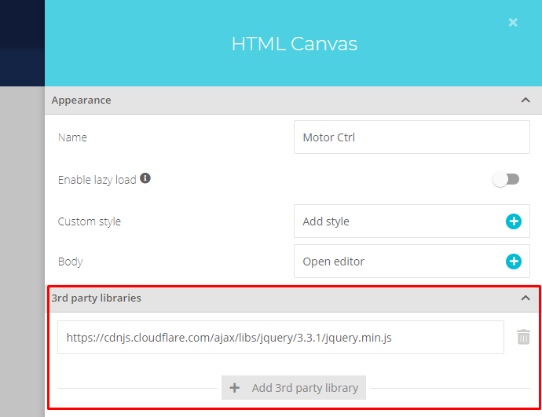
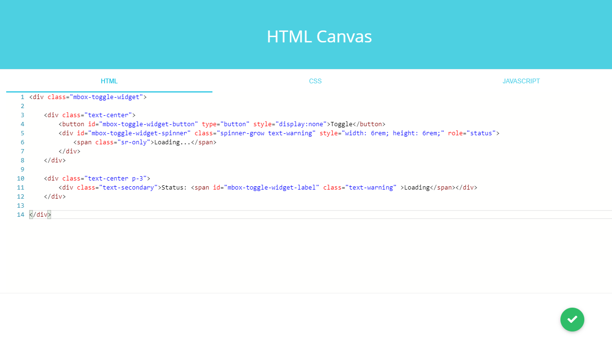

# ModbusBox Ubidots Toggle Widget
Custom Ubidots widget that updates its status based on the response from the device

### Third party libraries

#### jQuery

Add the jQuery CDN URL to the 3rd party libraries section in  the HTML canvas properties window.

https://cdnjs.cloudflare.com/ajax/libs/jquery/3.3.1/jquery.min.js

### Source files

Add the content of each file, in the corresponding section of the HTML canvas editor.

* Add the content of **widget.html** to the **HTML** tab

* Add the content of **widget.css** to the **CSS** tab

* Add the content of **widget.js** to the **JAVASCRIPT** tab

## Copyright

2019 © [IOTBITS](https://iotbits.net/)