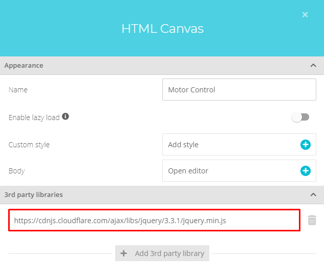
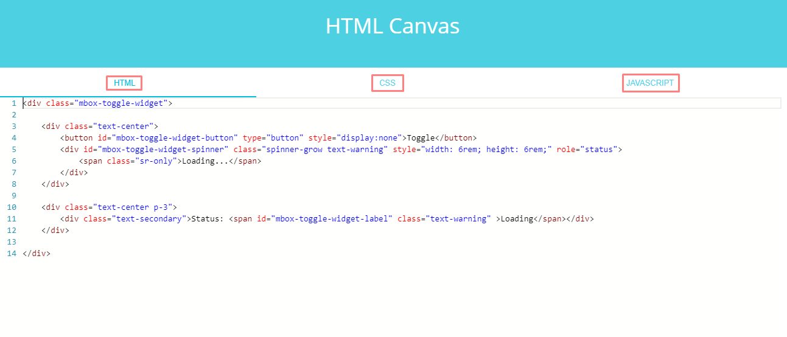

# ModbusBox Ubidots Widgets
Custom Ubidots widgets for ModbusBox devices.

### Widgets

[Power Control Widget](power-ctrl-widget/README.md)

[Speed Control Widget](speed-ctrl-widget/README.md)

### Third party libraries

All of the ModbusBox Ubidots Widget uses the jQuery library. Add the following URL to the 3rd party libraries section in  the HTML canvas properties window.

* https://cdnjs.cloudflare.com/ajax/libs/jquery/3.3.1/jquery.min.js

### Widget source code

Each widget has three files. Add the content of each file, in the corresponding section of the HTML canvas editor.

* Add the content of **widget.html** to the **HTML** tab.

* Add the content of **widget.css** to the **CSS** tab.

* Add the content of **widget.js** to the **JAVASCRIPT** tab.

## Copyright

2019 © [IOTBITS](https://iotbits.net/)