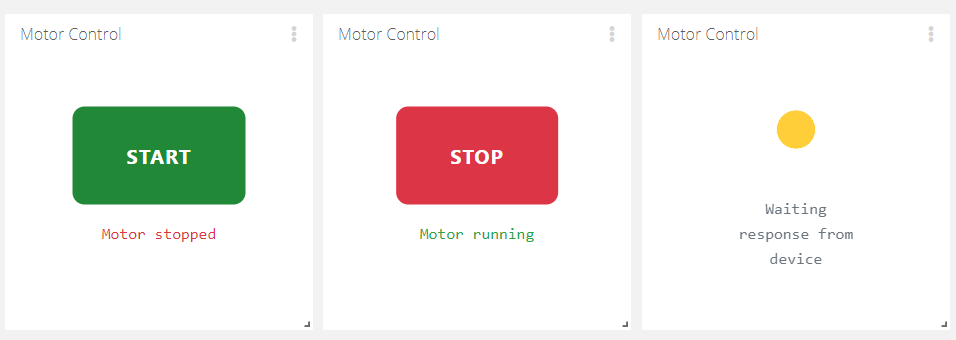
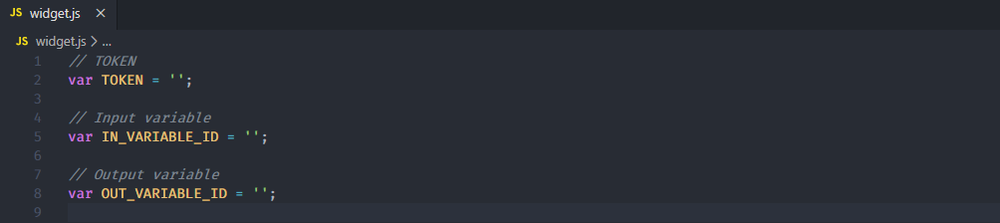
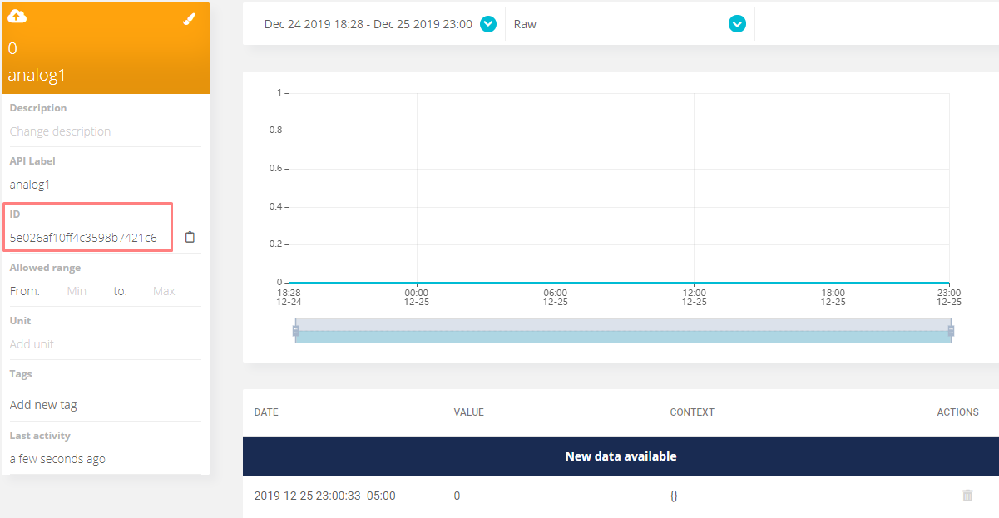

# Power Control Widget

Ubidots Power Control Widget for ModbusBox devices

### Description

The power control widget allows the user to control the drive's on/off status and show the current drive's state based on the response received from the device. 

### Widget Setup

The following three variable must be fill to be able to use the widget.

`TOKEN` : A valid Ubidots token

`IN_VARIABLE_ID` : ID of the variable that carries the widget's input data

`OUT_VARIABLE_ID` : ID of the variable that holds the widget's value to be sent

> The variable ID can be found in the variable's details section as shown in the image below

 

## Copyright

2019 © [IOTBITS](https://iotbits.net/)