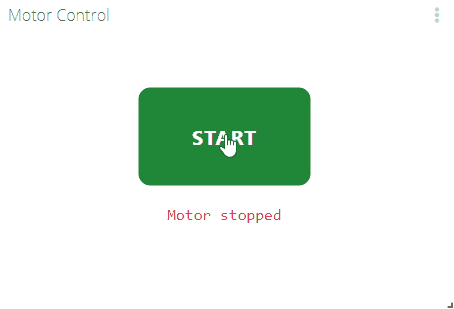

# Power Control Widget

Ubidots Power Control Widget for ModbusBox devices

### Description

The power control widget allows the user to control the drive's on/off status and show the current drive's state based on the response received from the device.

 

### Third party libraries

This widget uses the jQuery library. Add the following URL to the 3rd party libraries section in  the HTML canvas properties window.

* https://cdnjs.cloudflare.com/ajax/libs/jquery/3.3.1/jquery.min.js

### Widget Setup

The following three variable must be fill to be able to use the widget.

`TOKEN` : A valid Ubidots token

`IN_VARIABLE_ID` : ID of the variable that carries the widget's input data

`OUT_VARIABLE_ID` : ID of the variable that holds the widget's value to be sent

> The variable ID can be found in the variable's details section as shown in the image below

 

## Copyright

2019 © [IOTBITS](https://iotbits.net/)